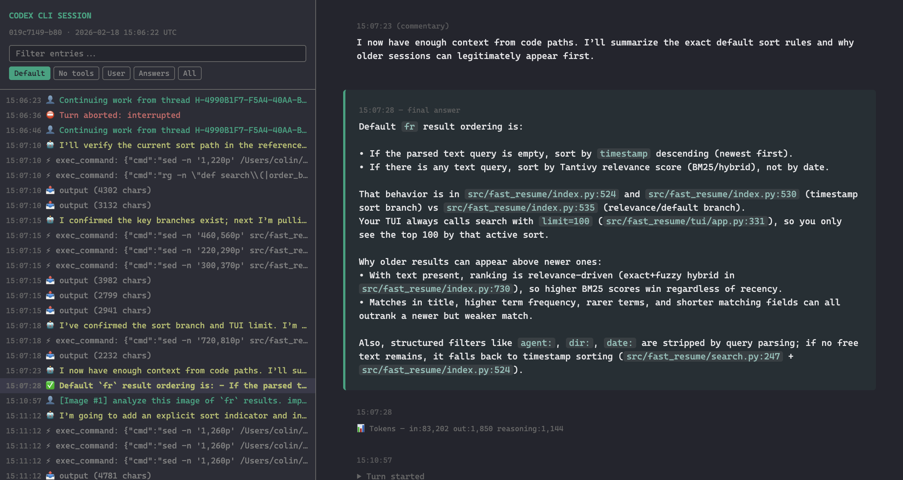

# codex-transcript-viewer

Converts Codex CLI JSONL session transcripts into single-file HTML viewers with sidebar navigation, search, and filtering. No external dependencies. Just open the `.html` in any browser.



See the [full demo](docs/demo.md) for more screenshots and a walkthrough of every feature.

## Install

Install straight from GitHub with uv:

```
uv tool install git+https://github.com/masonc15/codex-transcript-viewer.git
```

To hack on it, clone the repo and install from the checkout instead, or run it without installing:

```
git clone https://github.com/masonc15/codex-transcript-viewer.git
uv tool install ./codex-transcript-viewer
uv run --directory ./codex-transcript-viewer codex-transcript-viewer <session.jsonl>
```

## Usage

```
codex-transcript-viewer <session.jsonl> [output.html]
```

If you omit the output path it writes `<input-stem>.html` in the current directory.

Codex stores sessions as JSONL files under `~/.codex/sessions/`. Find one and point the tool at it:

```
codex-transcript-viewer ~/.codex/sessions/2026/02/18/rollout-2026-02-18T10-06-22-019c7149.jsonl
open rollout-2026-02-18T10-06-22-019c7149.html
```

Images are embedded, so the page stays a single file. Images you attached to a prompt are always included, taken from the copy saved in the session log, since the original file is often a temp file that's long gone. Screenshots returned by tools are embedded until they add up to 25 MB, after which the rest show as placeholders and a note at the top says how many were left out. `--max-image-mb N` changes that budget (0 means no limit), and `--no-images` replaces every image with a labelled placeholder, which is handy when you want a small page or would rather not share what was on your screen.

Tool output text is embedded in full. Codex already trims what the model sees to roughly 200K characters, so the viewer's own `--max-output-chars` guard (default 250,000, 0 to disable) only kicks in for something pathological.

If the log contains record types the viewer doesn't know about, it says so on stderr after writing the page, which usually means Codex changed its format.

## What the viewer shows

The page has a sticky sidebar with a searchable event tree on the left and the transcript on the right. Your prompts get a green border, with any attached images shown as thumbnails you can click to enlarge. Final answers sit on a faint green background, commentary is italic with a muted border, and reasoning summaries are gray. Each tool call shows its command or arguments, and its result is colored by what actually happened: green when the exit code was 0, red when it failed, and neutral when the log doesn't record a status, so nothing looks successful by accident. Long outputs expand on click. Turn starts, aborts, rollbacks and token counts show up as dim system lines.

The sidebar filters are Default, No tools, User, Answers and All. On narrow screens the sidebar tucks behind a hamburger menu.

Subagent threads are labelled with the agent's name and parent thread. When a subagent was forked with its parent's conversation, the copied turns are folded into a collapsed block at the top instead of being shown as if the subagent wrote them.

## Supported sessions

Both session formats Codex has used are handled: the older one, where prompts are `user_message` events (seen through CLI 0.125), and the newer one, where they're `item_completed` records (CLI 0.135 and later). Tool calls cover plain function calls, code-mode `exec` and `apply_patch` custom tools, web searches and tool searches.

## Limitations

The transcript is an activity log, so rolled-back turns stay inline with a banner rather than disappearing. The filters hide sidebar entries, not the transcript itself. Image generation calls aren't rendered yet.

## Credits

Inspired by the HTML session export in [pi](https://github.com/badlogic/pi-mono/blob/main/packages/coding-agent), a coding agent by [@badlogic](https://github.com/badlogic).

## Project structure

```
src/codex_transcript_viewer/
  parser.py       - JSONL parsing and event extraction
  markdown.py     - lightweight markdown-to-HTML conversion
  formatting.py   - timestamp formatting helpers
  html_builder.py - assembles the final HTML from events
  style.css       - all CSS for the viewer
  viewer.js       - sidebar filtering and navigation
  cli.py          - command-line entry point
```
