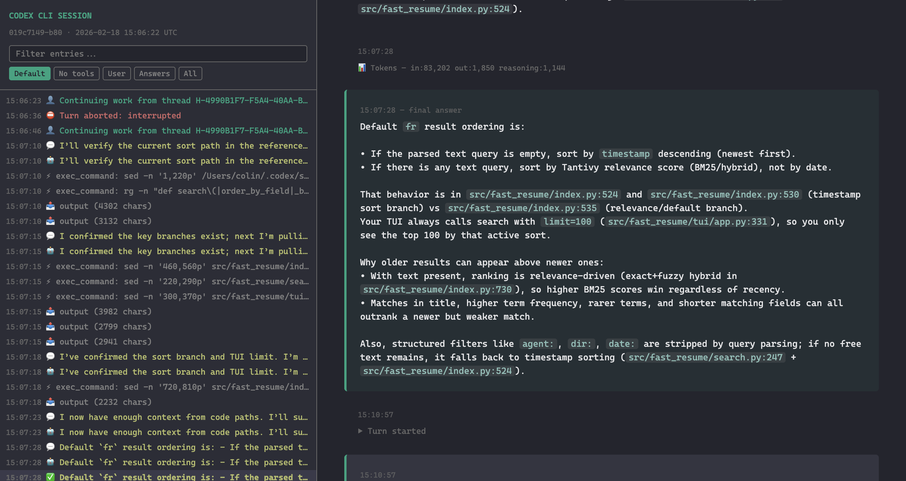
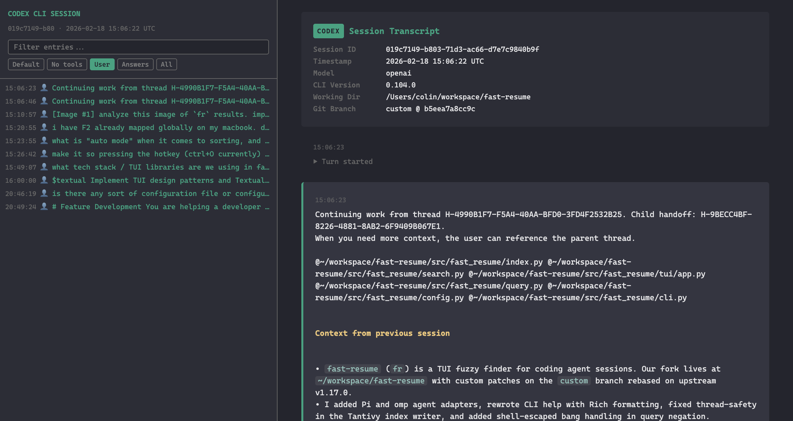
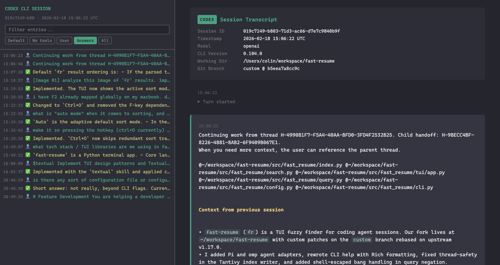

# codex-transcript-viewer Demo

codex-transcript-viewer converts Codex CLI JSONL session transcripts into self-contained HTML files you can browse in any browser. The output has a sidebar with navigation, search, and filtering alongside a main content pane that renders every event type with distinct visual treatment. No external dependencies — the entire viewer is a single .html file.

```bash
cd ~/workspace/codex-transcript-viewer && head -3 pyproject.toml && echo "---" && grep "^version" pyproject.toml
```

```output
[project]
name = "codex-transcript-viewer"
version = "0.1.0"
---
version = "0.1.0"
```

Here is the project structure. The entire tool is about 1200 lines of Python spread across a parser, HTML builder, markdown converter, and formatting helpers, plus CSS and JS that get inlined into the output.

```bash
find src/codex_transcript_viewer -type f -name "*.py" -o -name "*.css" -o -name "*.js" | sort | while read f; do echo "$f ($(wc -l < "$f") lines)"; done
```

```output
src/codex_transcript_viewer/__init__.py (       0 lines)
src/codex_transcript_viewer/cli.py (      37 lines)
src/codex_transcript_viewer/formatting.py (      23 lines)
src/codex_transcript_viewer/html_builder.py (     335 lines)
src/codex_transcript_viewer/markdown.py (      58 lines)
src/codex_transcript_viewer/parser.py (     182 lines)
src/codex_transcript_viewer/style.css (     476 lines)
src/codex_transcript_viewer/viewer.js (      61 lines)
```

To generate a viewer, point the tool at any Codex session JSONL file. Codex stores these under ~/.codex/sessions/.

```bash
uv run --directory ~/workspace/codex-transcript-viewer codex-transcript-viewer '/Users/colin/.codex/sessions/2026/02/18/rollout-2026-02-18T00-13-01-019c6f2a-7baf-7703-9b90-bac9cc85c961.jsonl' /tmp/demo-session.html 2>&1 && ls -lh /tmp/demo-session.html | awk '{print $5, $9}'
```

```output
written to /tmp/demo-session.html (22,761 bytes, 8 events)
22K /tmp/demo-session.html
```

The example below uses a 608-event session (908 KB output). Everything — CSS, JS, rendered HTML — gets packed into a single file.

```bash
ls -lh /Users/colin/codex-session-019c7149-b803-71d3-ac66-d7e7c9840b9f.html | awk '{print "Size:", $5}' && grep -c 'class="event' /Users/colin/codex-session-019c7149-b803-71d3-ac66-d7e7c9840b9f.html | xargs -I{} echo 'Events: {}'
```

```output
Size: 886K
Events: 192
```

## Full Viewer Overview

The viewer has two panels. On the left is a sticky sidebar with the session ID, a text search box, filter buttons (Default, No tools, User, Answers, All), and a scrollable event tree. On the right is the main content area where each event is rendered with its own visual style.


## Tool Call Rendering

Tool calls (exec_command, file reads, etc.) show the command or function name as a header with the arguments displayed in monospace. Token usage counters appear inline. Commentary messages from the agent are rendered in italic with a muted border.


## Final Answers

Final answers are highlighted with a green-tinted background and a "final answer" label. Markdown in the response is rendered — bullet lists, inline code references, and paragraph breaks all come through cleanly.



## Sidebar Filters

Five preset filters let you cut through long sessions quickly. "Default" hides low-signal system events. "No tools" strips out tool calls and their output so you see only the conversation. "User" shows your messages. "Answers" shows user messages plus final answers with checkmarks. "All" shows everything including turn-started, rolled-back, and token events.






## Search

The search box at the top of the sidebar does live text filtering across all event labels. Type a keyword and the sidebar instantly narrows to matching entries.


## How It Works

The parser reads each JSONL line and classifies it into event types — user messages, assistant responses (commentary vs final answer), tool calls, tool outputs, reasoning summaries, system events, and token counters. The HTML builder then walks the event list, applies visual styling per type, and inlines all CSS and JS into the output file.

```bash
head -40 src/codex_transcript_viewer/parser.py
```

```output
"""Parse Codex CLI JSONL session transcripts into structured events."""

from __future__ import annotations

import json
from pathlib import Path
from typing import Any


def parse_jsonl(path: str | Path) -> list[dict]:
    """Read a JSONL file and return a list of parsed JSON objects."""
    entries = []
    with open(path) as f:
        for line in f:
            line = line.strip()
            if not line:
                continue
            try:
                entries.append(json.loads(line))
            except json.JSONDecodeError:
                continue
    return entries


def extract_conversation(
    entries: list[dict],
) -> tuple[dict | None, list[dict]]:
    """Extract session metadata and meaningful conversation events.

    Returns (meta, events) where meta is the session_meta payload and events
    is a flat list of typed dicts representing user messages, assistant
    responses, tool calls, reasoning blocks, and system events.
    """
    events: list[dict] = []
    meta: dict | None = None

    for entry in entries:
        ts = entry.get("timestamp", "")
        etype = entry.get("type", "")
        payload = entry.get("payload", {})
```

The markdown renderer is intentionally lightweight — just enough to handle inline code, bold, italic, links, headers, lists, and code blocks that appear in agent responses. No third-party markdown library needed.

```bash
cat src/codex_transcript_viewer/markdown.py
```

```output
"""Lightweight markdown-to-HTML conversion for session transcripts."""

from __future__ import annotations

import html
import re


def escape(text: str | None) -> str:
    """HTML-escape text, returning empty string for None."""
    return html.escape(str(text)) if text else ""


def render_markdown(text: str) -> str:
    """Convert basic markdown to HTML.

    Handles fenced code blocks, inline code, bold, italic, headers, and
    unordered lists. Intended for session transcript content where full
    CommonMark compliance is unnecessary.
    """
    escaped = escape(text)

    # Fenced code blocks (```lang ... ```)
    def _replace_code_block(m: re.Match) -> str:
        lang = m.group(1) or ""
        code = m.group(2)
        return f'<pre><code class="language-{lang}">{code}</code></pre>'

    escaped = re.sub(
        r"```(\w*)\n(.*?)```", _replace_code_block, escaped, flags=re.DOTALL
    )

    # Inline code
    escaped = re.sub(r"`([^`]+)`", r"<code>\1</code>", escaped)

    # Bold
    escaped = re.sub(r"\*\*(.+?)\*\*", r"<strong>\1</strong>", escaped)

    # Italic (single asterisk, not adjacent to another asterisk)
    escaped = re.sub(
        r"(?<!\*)\*(?!\*)(.+?)(?<!\*)\*(?!\*)", r"<em>\1</em>", escaped
    )

    # Headers (h3 before h2 before h1 to avoid prefix conflicts)
    escaped = re.sub(
        r"^### (.+)$", r"<h3>\1</h3>", escaped, flags=re.MULTILINE
    )
    escaped = re.sub(
        r"^## (.+)$", r"<h2>\1</h2>", escaped, flags=re.MULTILINE
    )
    escaped = re.sub(
        r"^# (.+)$", r"<h1>\1</h1>", escaped, flags=re.MULTILINE
    )

    # Unordered list items
    escaped = re.sub(r"^- (.+)$", r"• \1", escaped, flags=re.MULTILINE)

    return escaped
```

## CLI Usage

The CLI is minimal — one required argument (the JSONL file), one optional argument (the output path). If you omit the output path it writes an HTML file with the same stem as the input in the current directory.

```bash
cat src/codex_transcript_viewer/cli.py
```

```output
"""Command-line interface for converting Codex CLI JSONL sessions to HTML."""

from __future__ import annotations

import sys
from pathlib import Path

from .html_builder import build_html
from .parser import extract_conversation, parse_jsonl


def main() -> None:
    if len(sys.argv) < 2:
        print("usage: codex-transcript-viewer <session.jsonl> [output.html]")
        sys.exit(1)

    inpath = Path(sys.argv[1])
    if not inpath.exists():
        print(f"error: {inpath} not found", file=sys.stderr)
        sys.exit(1)

    if len(sys.argv) >= 3:
        outpath = Path(sys.argv[2])
    else:
        outpath = Path(inpath.stem + ".html")

    entries = parse_jsonl(inpath)
    meta, events = extract_conversation(entries)
    html_content = build_html(meta, events)

    outpath.write_text(html_content, encoding="utf-8")
    size = outpath.stat().st_size
    print(f"written to {outpath} ({size:,} bytes, {len(events)} events)")


if __name__ == "__main__":
    main()
```
