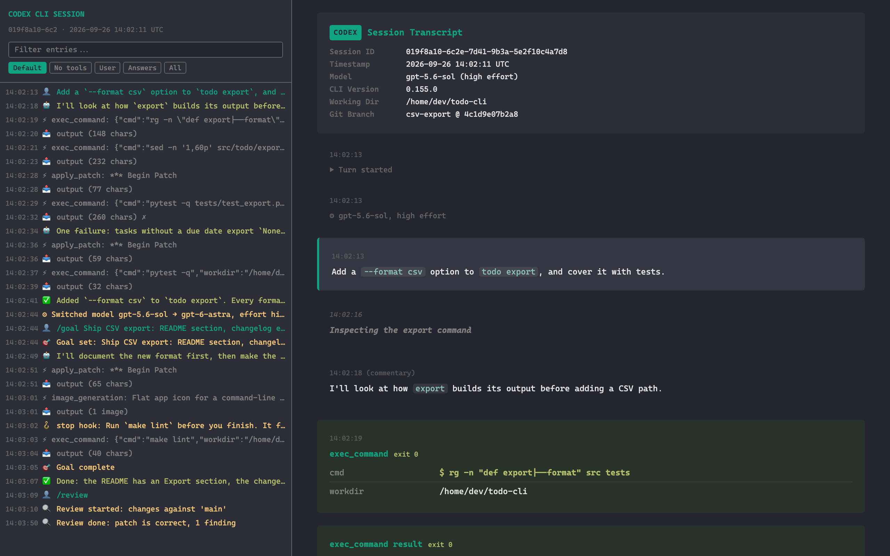
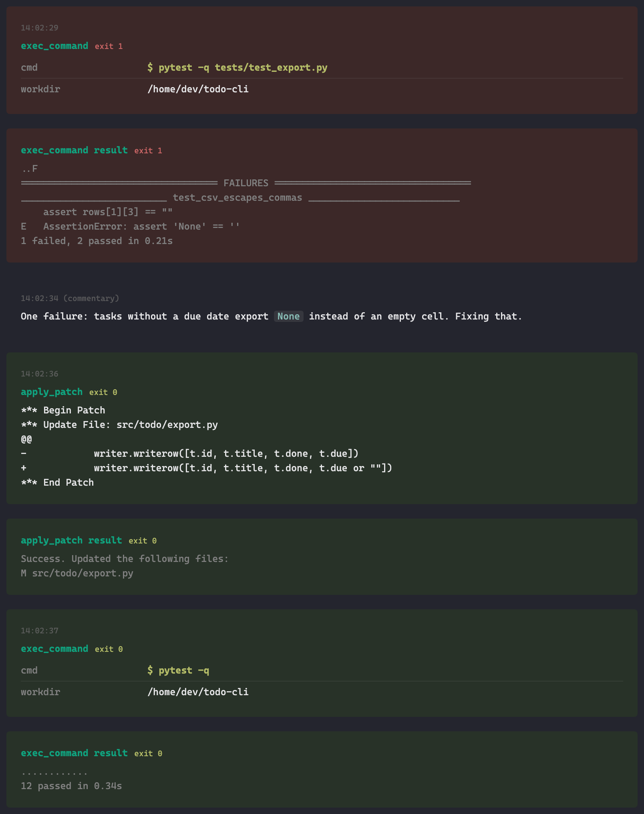
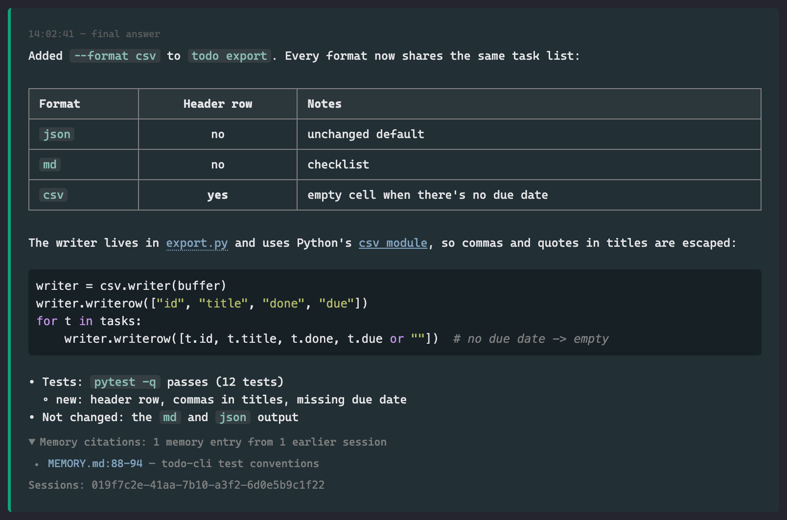
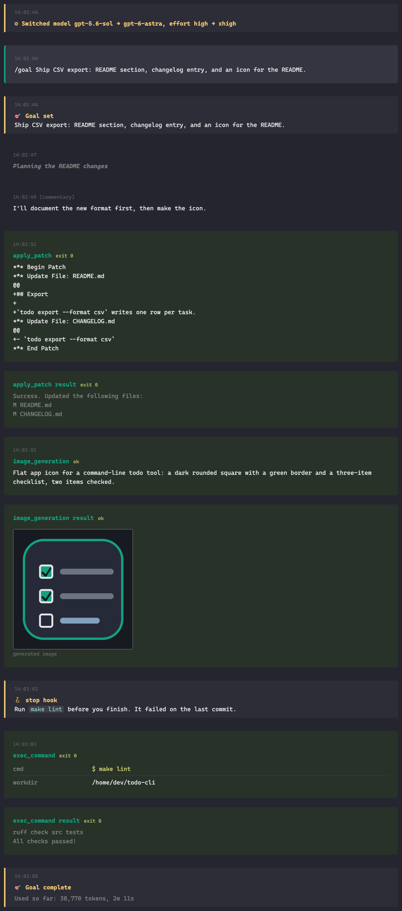
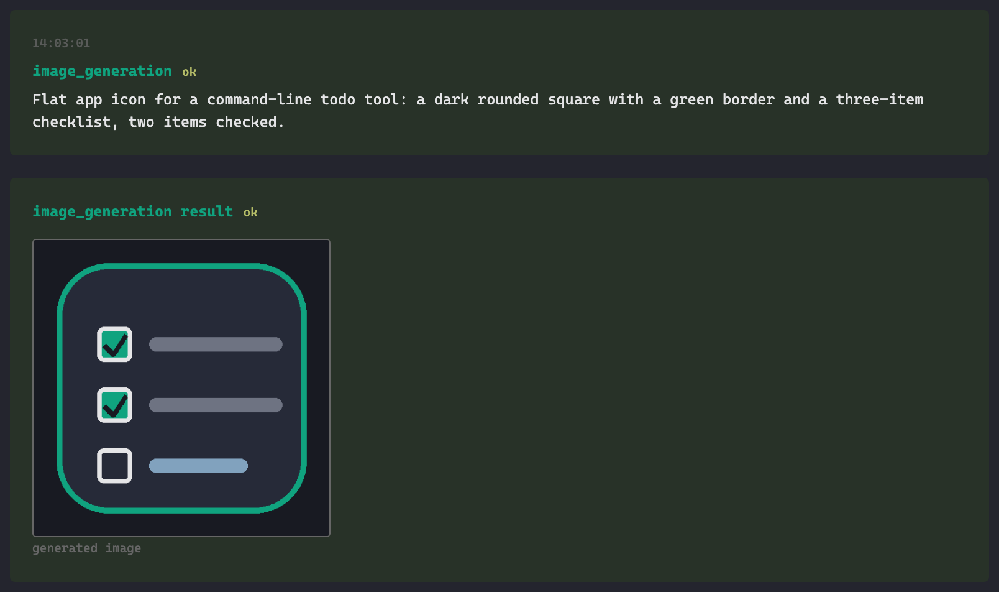
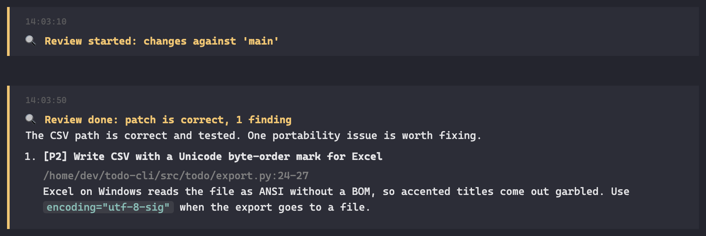
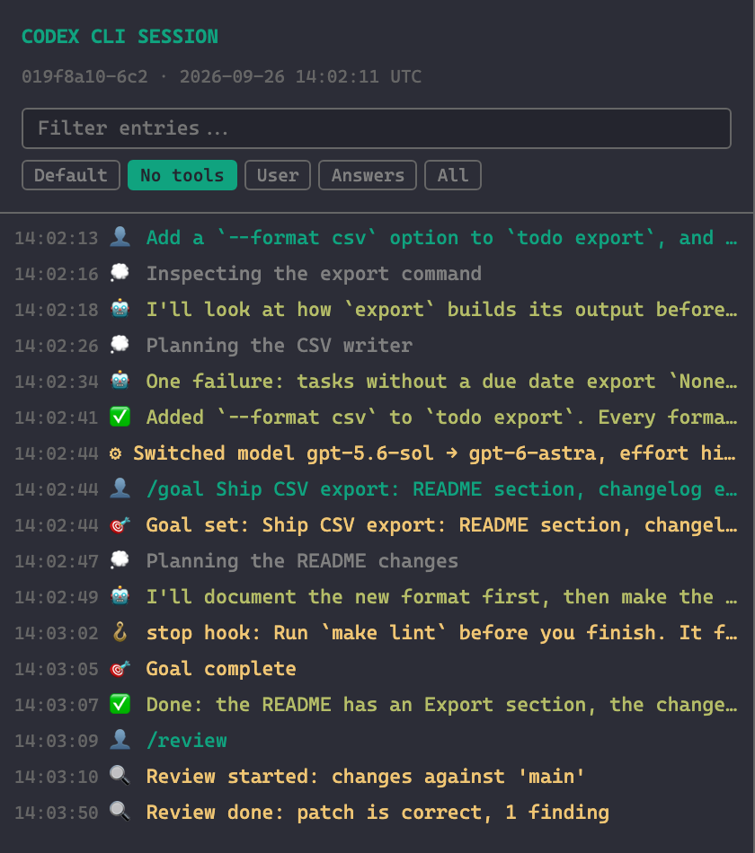
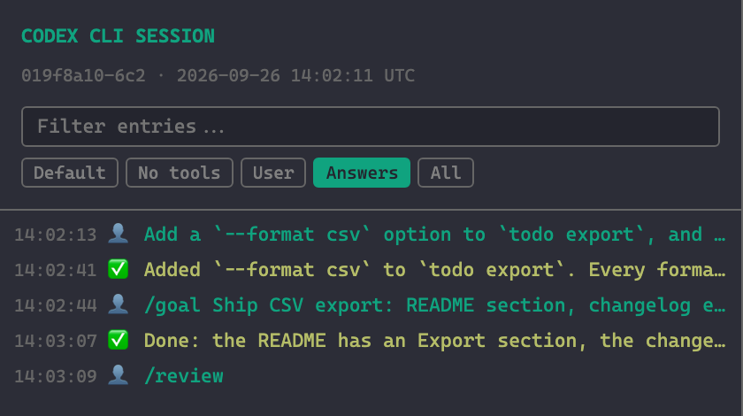
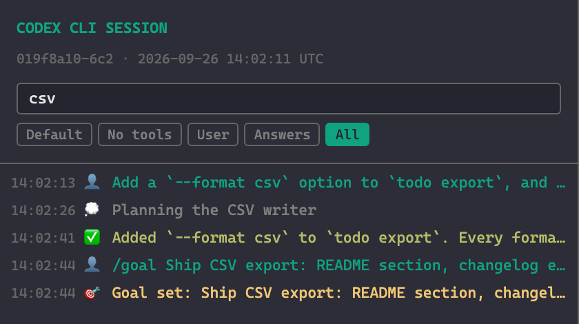

# codex-transcript-viewer demo

This page walks through what the viewer shows, using one short session: Codex adds a CSV export to a small todo CLI, works toward a `/goal`, generates an icon, and runs a code review. The session is made up (it's [`demo/session.jsonl`](demo/session.jsonl), written by [`demo/make_session.py`](demo/make_session.py)), so it can show every kind of entry without exposing a real one.

Converting it is one command:

```bash
codex-transcript-viewer docs/demo/session.jsonl demo.html
```

```output
written to demo.html (45,695 bytes, 43 events)
```

## The page

The sidebar on the left lists every entry in the session with its time, and the transcript fills the right. The header shows the session id, the model and reasoning effort the session started with, the CLI version, the working directory and the git branch. Clicking a sidebar row scrolls to that entry.



## Tool calls

Each tool call shows its command or arguments, and its result is colored by what actually happened: red for a non-zero exit, green for success, and neutral when the log records no status. Here the first test run fails, Codex patches the bug, and the second run passes. `apply_patch` shows the patch it applied.



## Answers

Final answers sit on a green-tinted background. Markdown renders the way Codex meant it: tables, bullet lists nested to any depth, inline code, and syntax-highlighted code blocks. Web links open in a new tab, and links to files show the file name with the full path on hover.

Codex ends some answers with a memory-citation block listing the notes and earlier sessions it drew on. Instead of printing that raw, the viewer folds it into a "Memory citations" section under the answer, shown expanded here.



## Goals, hooks and model changes

Some entries only ever reach the model, so the viewer shows them as highlighted rows of their own:

- **Model changes.** The header shows the model and effort the session started with; a row marks each turn that switches either one.
- **Goals** set with `/goal`, with their objective and every status change. Codex logs the goal again after nearly every step to update its counters, so only real changes appear.
- **Hook messages**, such as a stop hook telling Codex to run the linter before it finishes.



## Generated images

Images the model generates render as the result of their `image_generation` call, under the prompt it used. They count toward the `--max-image-mb` budget like other tool images.



## Code reviews

A `/review` gets start and result markers. When no reply repeats the review, as here, the findings are listed with their file and lines.



## Filters and search

Five filters cut a long session down. Default hides turn markers, token counts and reasoning. No tools hides tool calls, turn markers and token counts but keeps reasoning, leaving the conversation. User shows only your prompts, Answers shows prompts and final answers, and All shows everything.





The search box narrows the sidebar to entries containing what you type.



## Rebuilding this page

The session and screenshots are generated, so they can be rebuilt after a change to the viewer:

```bash
python3 docs/demo/make_session.py
uv run --with playwright python docs/demo/screenshots.py
```
